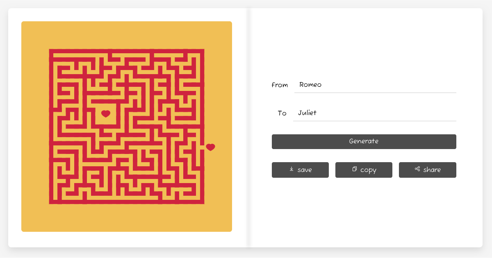
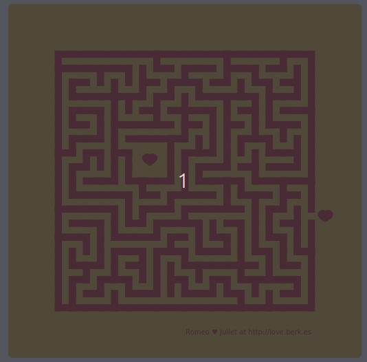

## Lost in Love

Lost in Love is a project by [Bèr Kessels](https://berk.es) to create and share a unique maze for you and your love. The maze is generated based on the names you provide. The maze is unique to you and your love, and can be shared with a unique URL.

### What is it?

**Lost in Love** is an art project. It is so called [generative art](https://en.wikipedia.org/wiki/Generative_art): I write the software, and the software creates art autonomously. A nice introduction into generative art is [this talk by Tim Holman](https://www.youtube.com/watch?v=4Se0_w0ISYk).

### What inspired you?

In a gallery in London, I came across gorgeous screenprints by [Ricky Byrne](https://rbyrneart.com/). I loved their use of color and hand-produced feel. Attention for color, layout, tension.

So I started experimenting with maze generation algorithms in Rust, with Nannou. In the process, I decided to make it a web app, for Valentine, so everyone can create their own maze. And ported the Rust code to TypeScript in a tiny web app. [The Coding Train has a great tutorial set on maze generation](https://www.youtube.com/watch?v=HyK_Q5rrcr4). I used the same common recursive backtracking algorithm, because the aesthetics are what I was looking for.

### How does it work?

The names you provide are used to generate [unique randomness](https://en.wikipedia.org/wiki/Random_seed). This is used in a [maze generation algorithm](https://en.wikipedia.org/wiki/Maze_generation_algorithm) to create a maze. I deliberately chose to animate the maze generation, to show the process. It is a slow process, but I think it is interesting to watch it carve out your maze.

### Saving, copying and sharing doesn't work

Saving, copying and sharing the maze is disabled until the maze is generated. Once the maze is generated, you can save, copy and share the maze. Sharing, copying won't work on all browsers and is affected by some browser plugins or settings. The best result is on Chrome on Android.

### Can I customize the maze?

**No**, the only parameter you can provide is the names. The maze is generated based on these names, and the algorithm is fixed. This is by design. Only the two names determine the artwork. However, you can change the source code, see below.

### Where is the code?

The code is available on [GitHub](https://github.com/berkes/art/tree/main/lost-in-love). Feel free to fork, change and improve it, or just have fun with it.

### What did you use?

- [Nannou](https://nannou.cc/) for the original maze generation
- [p5.js](https://p5js.org/) for the web version
- [Vite](https://vitejs.dev/) for the build and web stuff
